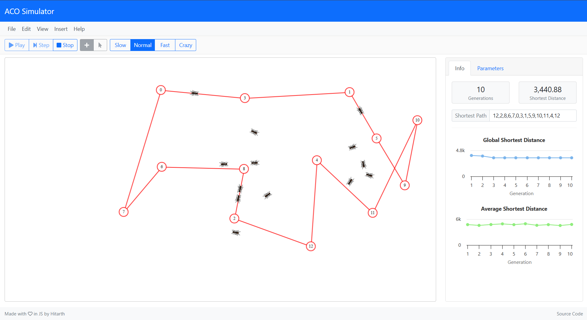

# 🐜 Ant Colony Optimization Simulator

An interactive **Ant Colony Optimization (ACO)** simulator built in **HTML/CSS + JavaScript**
Watch ants collaborate, build paths, and optimize routes in real time!

---

## 🚀 Features
- Customizable interactive speeds
- Animated simulation of **Ant System** and **Ant Colony System**.
- Interactive interface – add nodes by clicking on the canvas.
- Visualize how ants deposit pheromones and find optimized paths.

---

## 🎮 How to Use
1. Open the simulator: [ACO Simulator Live Demo](https://aco-simulation.netlify.app/)  
2. Click on the screen to **add new nodes** (Places of interest).  
3. Press **Play** and watch the ants collaborate together to find the optimal shortest route.  

---

## 🧮 Implemented Algorithms
- **Ant System (AS)**  
- **Ant Colony System (ACS)**  

---

## 📸 Screenshots
Here’s what the simulator looks like in action:

  
